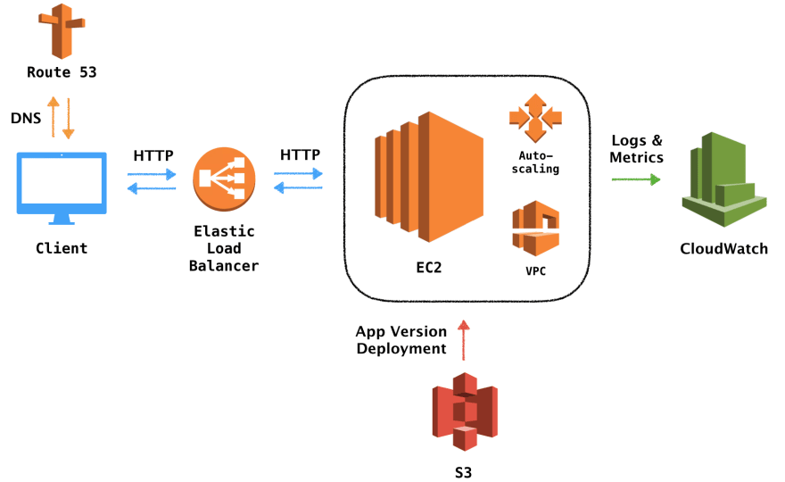

# Flask Application Deployment
This repository deploys a simple flask application on AWS Elastic Beanstalk platform. 

The working structure of the Elastic Beanstalk is shown above. The reference for this image is shown in the Reference section.  
This flask application says "hello" to the user. The source code is included in the `application.py` file and by adding `\username` to the end of the application url once the application is opend, the application says `hello` to that specific username. The following implementation shows how to create Elastic Beanstalk environment, how to open the application, and how to terminate the environment using Elastic Beastalk Command Line Interface (EB CLI). The same procedure could be done using the AWS management console and the Elastic Beanstalk Console, but the EB CLT method is more convenient to show and use in practices.  
The Elastic Beanstalk provides an efficient platform to deploy the web application, but the continuous delivery is handled by the Code Pipeline service in AWS. The name itself, Code Pipeline, has elucidated the meaning of continuous delivery, which is to update the application without stopping the application service and bugs. This function is guaranttee by the build and test part in the code Pipeline, and the application won't be updated until those two parts give the green light to the update. Therefore, to ensure the continuous delivery of the application, the flask application that has beend deployed on the Elastic Beanstalk is attached to the Code Pipeline. The sepcific implementation is shown below. 

## Implementation 
1. Install and Configure the Elastic Beanstalk Comand Line Interface (EB CLI) through [EB CLI](https://docs.aws.amazon.com/elasticbeanstalk/latest/dg/eb-cli3-install.html). 
2. After the installation and configuration is Done. Clone the repository and unzip it. Change the working directory to the unzipped file.
3. Use the following command to create EB environment, open the flask application, and terminate EB environemt after completing using the application.  
+ Create an environment on EB. You can determine the name. Note that this process might take a long time since EB will create a list of necessary components to do the computation, security, load balance, and etc. It will create an Amazon EC2 instance, a security group, an Auto Scaling group, an Amazon S3 bucket, Amazon CloudWatch alarms, and a domain name for your application. 
`eb create {your-env-name}`  
+ Open the deployed Flask Application.  
`eb open`  
+ Terminate the Environment.  
`eb terminate {your-env-name}`
4. Follow this [website]() to add the EB to the Code Pipepline. 
## Reference 
1. [Image](https://dev.to/frosnerd/deploying-an-http-api-on-aws-using-elastic-beanstalk-5dh7)
